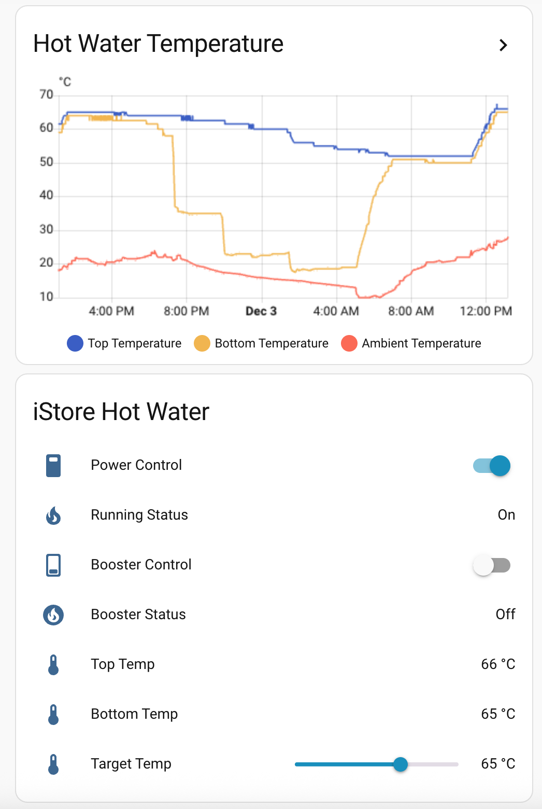
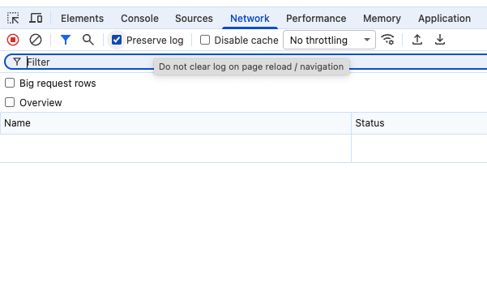
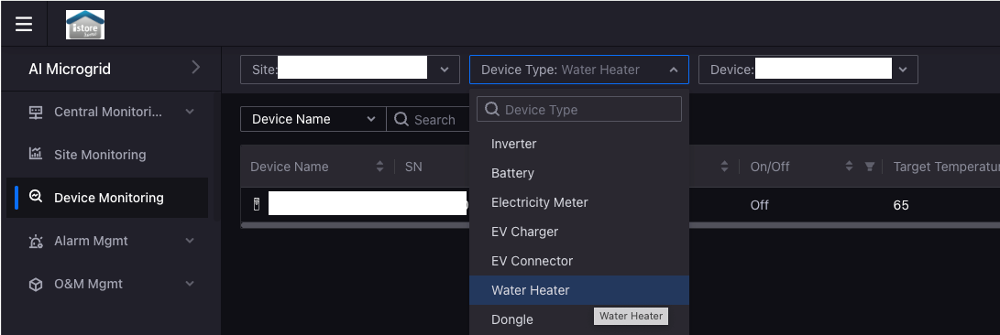
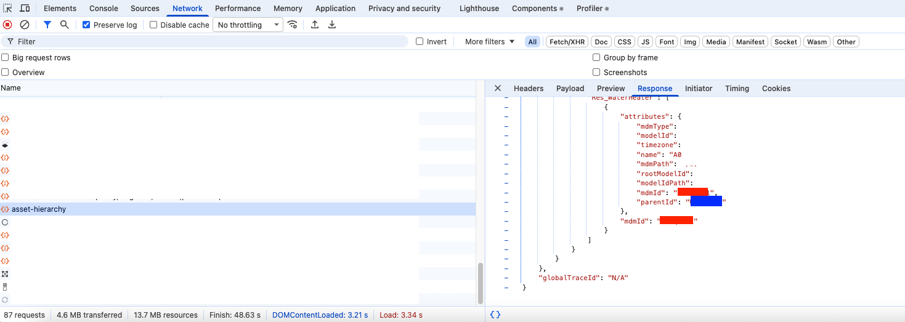
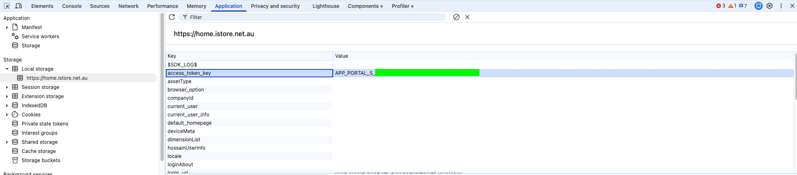
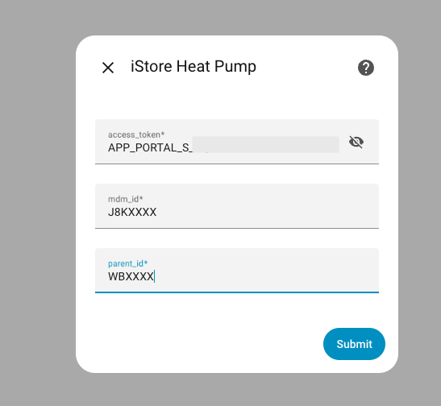

# iStore Heat Pump — Home Assistant Custom Integration

A Home Assistant custom integration for iStore Hot Water System (R290).
Provides full monitoring + control using the official iStore API. This integration requires the iStore Heat Pump system with the WiFi module installed and connected to the Univers EMS mobile app. Most iStore Hot Water Systems installed after November 2025 include the WiFi module.

### Sample of Home Assistant Dashboard


## Features

### Live Monitoring
- Top, Bottom, Target temperature
- TargetMin and TargetMax
- Ambient, Coil, Suction temperature
- Compressor status
- System running state
- Booster state
- Work mode (Standby / Heating / Eco / Hybrid / Boost)
- 4-Way Valve status
- Fan status
- Defrost status
- Timer 1 and Timer 2 schedules (enabled / disabled / on time / off time)

### Thermodynamic Sensors
- Remaining hot water at tempering temperature (liters)
- Estimated shower time remaining at configured temperature and flow rate

### Controls
- Power ON/OFF
- Booster ON/OFF
- Work mode selection (Standby / Heating / Eco / Hybrid / Boost)
- Timer 1 and Timer 2 enable/disable
- Timer 1 and Timer 2 schedule time configuration
- Work mode selection (Standby / Heating / Eco / Hybrid / Boost)
- Device name editing (synced with iStore portal)

### Future Features (v2.1+)
- Estimated power sensor (W) for HA Energy Dashboard
- Icon consistency pass (all entities with appropriate MDI icons)

### Temperature Control
Temperature adjustment is intentionally disabled. Operating outside iStore's tested range (15–62°C) risks compressor damage, dramatically reduces efficiency (COP drops from ~8.5 to ~1 at high temperatures), and may void your warranty. Delivered water temperature is set by your tempering valve (typically 50°C), not the tank thermostat.

---

## Installation

### HACS (recommended)

1. Add this repository as a custom repository in HACS
2. Search for "iStore Heat Pump" in HACS and install
3. Restart Home Assistant
4. Go to Settings → Devices & Services → Add Integration → "iStore Heat Pump"

### Manual Install

1. Copy the `custom_components/istore_heatpump` folder into `/config/custom_components/istore_heatpump/`
2. Restart Home Assistant
3. Go to Settings → Devices & Services → Add Integration → "iStore Heat Pump"

---

## Configuration

Enter the email and password you use to log in at https://home.istore.net.au

That's it. The integration automatically discovers your device, manages session tokens, and refreshes authentication when needed. No browser developer tools required.

### Options

After setup, you can configure thermodynamic calculation parameters. In Home Assistant, go to **Settings → Devices & Services → iStore Heat Pump → Configure**.

| Parameter | Default | What to set |
|---|---|---|
| Cold Water Temp | 15°C | Your mains cold water temperature. Run the cold tap for 30 seconds and measure. Australian mains water ranges 10–20°C depending on season and location. Perth averages ~17°C. A 5°C error changes hot water estimates by ~10%, so defaults are fine if you're unsure. |
| Shower Flow Rate | 9.0 L/min | Your shower head output. Time how long it takes to fill a 10L bucket at your normal shower pressure. Standard heads run 9–12 L/min, water-saving heads 6–9, rain heads 12–20. |
| Shower Temp | 40°C | Your preferred shower temperature. 38–42°C is typical. This is personal comfort, not a measured value. |
| Tempering Temp | 50°C | Your tempering valve output. Australian Standard AS/NZS 3500.4 mandates 50°C maximum for personal hygiene. Almost all valves are factory-set to 50°C — check the label on the valve body if unsure. Leave at 50 unless you've had it adjusted. |
| Tank Volume | 0 (auto) | Your tank capacity in liters. Leave at 0 to auto-detect from the iStore API (recommended). Only override if the auto-detected value is wrong. |

If you don't know any of these values, leave the defaults. The calculated sensors will still be accurate enough for "do I have enough hot water?" decisions.

---

## Sensors

| Entity | Type | API Point | Description |
|---|---|---|---|
| sensor.istore_top_temperature | Temperature | WH.TopTemp | Tank top temperature |
| sensor.istore_bottom_temperature | Temperature | WH.BottomTemp | Tank bottom temperature |
| sensor.istore_target_temperature | Temperature | WH.TargetTemp | Current target temperature |
| sensor.istore_ambient_temperature | Temperature | PUB_WH.EnvirTemp | Ambient temperature |
| sensor.istore_coil_temperature | Temperature | PUB_WH.CoilTemp | Coil temperature |
| sensor.istore_suction_temperature | Temperature | PUB_WH.SuctionTemp | Suction temperature |
| sensor.istore_target_temp_min | Temperature | WH.TargetTempMin | Minimum target limit |
| sensor.istore_target_temp_max | Temperature | WH.TargetTempMax | Maximum target limit |
| sensor.istore_power_mode | Status | WH.OnOff | Power state (On/Off) |
| sensor.istore_remaining_hot_water_at_tempering_temp | Volume | Calculated | Tempered output volume after mixing with cold water (L) |
| sensor.istore_raw_hot_volume_above_tempering_temp | Volume | Calculated | Raw hot water volume above tempering temp (L) |
| sensor.istore_estimated_shower_time_remaining | Duration | Calculated | Estimated shower time (min) |

> **Note:** `sensor.istore_work_mode` exists but is disabled by default — the `select.istore_work_mode` entity is preferred as it shows the current mode AND allows changing it.

## Binary Sensors

| Entity | API Point | Default | Description |
|---|---|---|---|
| binary_sensor.istore_running_state | PUB_WH.CompressorStatus | ✅ | System running |
| binary_sensor.istore_booster_state | PUB_WH.Booster | ✅ | Booster active |
| binary_sensor.istore_4_way_valve | PUB_WH.4WayStatus | ✅ | 4-way valve engaged |
| binary_sensor.istore_fan_status | PUB_WH.FanSpeed | ✅ | Fan running |
| binary_sensor.istore_defrost_status | PUB_WH.DefrostStatus | ✅ | Defrost cycle active |
| binary_sensor.istore_compressor_status | PUB_WH.CompressorStatus | ❌ | Same as Running State (disabled) |
| binary_sensor.istore_timer_1_enabled | PRI_RE_WH.Timer1On | ❌ | Timer 1 active (switch preferred) |
| binary_sensor.istore_timer_1_disabled | PRI_RE_WH.Timer1Off | ❌ | Timer 1 inactive (switch preferred) |
| binary_sensor.istore_timer_2_enabled | PRI_RE_WH.Timer2On | ❌ | Timer 2 active (switch preferred) |
| binary_sensor.istore_timer_2_disabled | PRI_RE_WH.Timer2Off | ❌ | Timer 2 inactive (switch preferred) |

> Disabled sensors can be enabled in Settings → Devices & Entities → filter "disabled".

## Switches

| Entity | Control | Description |
|---|---|---|
| switch.istore_power | WH.OnOff | Heat pump power |
| switch.istore_booster | PUB_WH.Booster | Booster element |
| switch.istore_timer_1 | PRI_RE_WH.Timer1On | Timer 1 enable |
| switch.istore_timer_2 | PRI_RE_WH.Timer2On | Timer 2 enable |

## Select

| Entity | Control Point | Description |
|--------|--------------|-------------|
| select.istore_work_mode | PUB_WH.WorkMode | Work mode (Standby/Heating/Eco/Hybrid/Boost) |

## Time Inputs

| Entity | API Point | Default | Description |
|---|---|---|---|
| time.istore_timer_1_on_time | PRI_RE_WH.Timer1OnTime | ✅ | Timer 1 start time |
| time.istore_timer_1_off_time | PRI_RE_WH.Timer1OffTime | ✅ | Timer 1 stop time |
| time.istore_timer_2_on_time | PRI_RE_WH.Timer2OnTime | ✅ | Timer 2 start time |
| time.istore_timer_2_off_time | PRI_RE_WH.Timer2OffTime | ✅ | Timer 2 stop time |

---

## Notes

- Commands take up to 15 seconds to take effect (API latency), then a 12-second delay before the integration refreshes state
- Sensor data polls every 30 seconds
- Authentication is handled automatically — enter your username and password once, the integration manages tokens, session expiry, and re-authentication
- Changing your iStore password? Remove and re-add the integration, or update the password in your HA config entry
- **Security:** Your iStore password is stored in Home Assistant's config entry (`.storage/core.config_entries`). This is HA's standard pattern for cloud integrations and is only accessible to the HA user. Back up your config securely and avoid sharing full config dumps on forums.

---

## Architecture

The integration follows Home Assistant's [CoordinatorEntity](https://developers.home-assistant.io/docs/integration_fetching_data) pattern. A `DataUpdateCoordinator` polls the iStore cloud API every 30 seconds. All entities read their state from the coordinator's cached data — they never make API calls directly.

```
custom_components/istore_heatpump/
├── __init__.py         Entry point, device setup, platform forwarding
├── api.py              iStore cloud API client (auth, RSA, 401 retry)
├── config_flow.py      Setup wizard (username/password → auto-discover)
├── options_flow.py     Post-setup thermodynamic parameter config
├── const.py            Domain name, config keys, tank volume defaults
├── coordinator.py      DataUpdateCoordinator (30s poll)
├── device.py           HA DeviceInfo from API attributes
├── sensor.py           Temperature sensors, thermodynamic calculations
├── binary_sensor.py    10 on/off state sensors
├── switch.py           Power, Booster, Timer 1/2 toggles
├── select.py           Work mode selector
├── time.py             Timer schedule time inputs
└── text.py             Device name editor
```

Architecture decisions are documented in `docs/decisions/`. See [ADR-001](docs/decisions/ADR-001-v2-architecture.md) for the v2.0 fork rationale and [ADR-002](docs/decisions/ADR-002-v2.1-security-and-quality.md) for v2.1 security hardening.

## Developer Commands

| Command | Purpose |
|---|---|
| `ruff check custom_components/istore_heatpump/` | Lint |
| `pytest tests/ -v` | Run unit tests (113 tests) |
| `for f in custom_components/istore_heatpump/*.py; do python3 -m py_compile "$f"; done` | Syntax check |
| `.forgejo/workflows/ci.yml` | CI pipeline (lint + test + syntax + manifest + pip-audit) |

---

## Acknowledgments

Built on work by [@kungbernard](https://github.com/kungbernard) (original API client), [@VeneficusMortis](https://github.com/VeneficusMortis) (authentication, device definition, timer controls), [@clutrz](https://github.com/clutrz) (batch timer writes, thermodynamic sensors, options flow), and [@phyzical](https://github.com/phyzical) (HACS structure).

## Disclaimer

This is a community-built integration and is not affiliated with iStore.
Use at your own risk.

---

# Original README (kungbernard/istore-ha)

Preserved as forked, for history and attribution. Superseded by the sections
above — the manual access-token extraction below is no longer needed
(v2.0+ authenticates with username/password directly), and the `Sensors`/
`Configuration` tables reflect the pre-rewrite entity set.

# iStore Heat Pump – Home Assistant Custom Integration

A Home Assistant custom integration for iStore Hot Water System (R290).
Provides full monitoring + control using the official iStore API. This integration can only be used with the iStore Heat Pumps system that has already fitted in the wifi module, and able to connect with the Univers EMS mobile app. Most iStore Hot Water System that installed posted November 2025 should comes with the wifi module. 

### Sample of Home Assistant Dashboard


## Features

### Live Monitoring
- Top temperature  
- Bottom temperature  
- Target temperature  
- TargetMin & TargetMax  
- Ambient / Coil / Suction temperature  
- Compressor status  
- System running state  
- Booster state  
- Work mode (Eco / Boost / Hybrid / etc.)  
- Timer 1 and Timer 2 schedules  
  - Enabled / disabled  
  - On / Off time  

---

## Full Control
- Power ON/OFF  
- Booster ON/OFF  
- Set Target Temperature  (must be between min and max temperature)
- Set Min/Max Temperature  (10-75 degrees)

---

## Installation

### Manual Install

1. Copy the **istore_heatpump** folder into:
/config/custom_components/istore_heatpump/

2. Restart Home Assistant

3. Go to:
Settings → Devices & Services → Add Integration → "iStore Heat Pump"

---

## Configuration

The integration requires 3 inputs:

| Field | Description |
|-------|-------------|
| access_token | From browser Network tab (`Bearer APP_PORTAL_S_...`) |
| parent_id | From asset-hierarchy API (`parentId`) |
| mdm_id | Device ID (`mdmId`, e.g. J8PqiKt2) |


To acquire the above parameters, please follow the following steps:

1. Open a desktop web browser (eg. Google Chrome) and open the URL https://home.istore.net.au/

2. Right click on the web page (any white space), then click "Inspect", this opens the Developer Console

3. Go to "Network" tab in the Developer Console, then check the "Preserve log" box


4. Login using the same credential as the Univers EMS mobile app where you have setup to control the iStore R290 hot water system

5. After login to iStore, navigate to "Device Monitoring" on the left menu, the click on "Device Type" drop down, and choose "Water Heater"


6. Find the "asset-hierarchy" in the list below (in the Network tab of Developer Console) and click on it. Then select the "Response" tab on the right. Check on the json data where it should has "Res_WaterHeater", and under attributes, there's "mdmId" and "parentId". These are the mdm_id and parent_id. Note: if the asset-hierarchy doesn't have the mdmId and parentId, just refresh the web page and try again.


7. Click on "Application" tab on the top of the Developer Console, then expand "Local storage" -> "https://home.istore.net.au", and find the "access_token_key" on the right hand side list, the key should looks like APP_PORTAL_X_XXXXXXXXXX, this is the access_token.


### Please do not log out from iStore website, you can simply close the web page / web browser. If you log out, the access token will no longer be valid

8. After acquire all the 3 parameters, you can now "Add Integration" in Home Assistant and add the iStore Heat Pump custom component using the 3 parameters.



---

## Sensors
| Entity | API Point | Description |
|--------|-----------|-------------|
| sensor.istore_top_temperature | WH.TopTemp | Tank top temperature |
| sensor.istore_bottom_temperature | WH.BottomTemp | Tank bottom temperature |
| sensor.istore_target_temperature | WH.TargetTemp | Current target temperature |
| sensor.istore_target_temperature_min | WH.TargetTempMin | Minimum target limit |
| sensor.istore_target_temperature_max | WH.TargetTempMax | Maximum target limit |
| sensor.istore_ambient_temperature | PUB_WH.EnvirTemp | Ambient temperature |
| sensor.istore_coil_temperature | PUB_WH.CoilTemp | Coil temperature |
| sensor.istore_suction_temperature | PUB_WH.SuctionTemp | Suction temperature |
| sensor.istore_compressor_status | PUB_WH.CompressorStatus | Compressor on/off |
| sensor.istore_booster_state | PUB_WH.Booster | Booster state (1=On, 2=Off) |
| sensor.istore_work_mode | PUB_WH.WorkMode | Work mode (Eco, Boost, Hybrid, etc.) |
| sensor.istore_timer1_on | PRI_RE_WH.Timer1On | Timer 1 enabled |
| sensor.istore_timer1_on_time | PRI_RE_WH.Timer1OnTime | Timer 1 ON time |
| sensor.istore_timer1_off | PRI_RE_WH.Timer1Off | Timer 1 disabled |
| sensor.istore_timer1_off_time | PRI_RE_WH.Timer1OffTime | Timer 1 OFF time |
| sensor.istore_timer2_on | PRI_RE_WH.Timer2On | Timer 2 enabled |
| sensor.istore_timer2_on_time | PRI_RE_WH.Timer2OnTime | Timer 2 ON time |
| sensor.istore_timer2_off | PRI_RE_WH.Timer2Off | Timer 2 disabled |
| sensor.istore_timer2_off_time | PRI_RE_WH.Timer2OffTime | Timer 2 OFF time |

---

## Notes

- Since this is using iStore API to control the hot water system, it will take up to 15 seconds for any changes (eg. On/Off, change temperature, Booster etc.)
- Sensor data are updated every 30 seconds
- It use the same access token, so make sure you do not "logout" the web page where you acquire the access token. However, you can safely just close the browser or web page without logging out. The access token will not expire as long as you dont actively logout the session that you originally acquire the access token.

---

## Disclaimer

This is a community-built integration and is not affiliated with iStore.
Use at your own risk.
